# OpenGLModern Engine

**Table of Contents**

[TOCM]

[TOC]

### Description
A engine making use of Open Graphics Library in order to render fully 3D models and scenes based on data gathered from .obj file, it's corresponding .mtl file as well as several other parameters such as lighting and transform taken from .scn files.

## INSTALLATION

To simply play the game:
- Download the latest build: https://game-project-assets.s3.amazonaws.com/OpenGLModern/build.zip
- Extract the zip
- Launch from "Engine.exe"

To open in Visual Studio:
- Download ZIP of code & extract.
- Download assets here: https://game-project-assets.s3.amazonaws.com/OpenGLModern/Resources.zip
- Extract assets into the "/Engine/Engine" directory of project
- Open "/Engine/Engine.sln" file with Visual Studio

### Features

- Supports 3D models defined by an OBJ file with 3-vertex(*triangle*) faces
- MTL file parser
- Capable of loading any texture format supported by the STB_IMAGE library, to include TGA, PNG, JPEG, BMP, GIF, etc.
- Capable of rendering multiple scenes, each with multiple models.
- Background configurable on a per scene basis
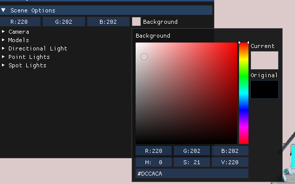

- Models rendered: 
	* Can be transformed via translation, rotation & scale**\***
	* Can be disabled
	* Textures can be deactivated and replaced with a configurable color
	* Wireframe mode
	* Are navigable via a slider **\*\***

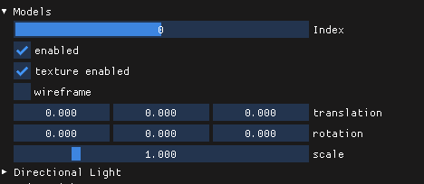
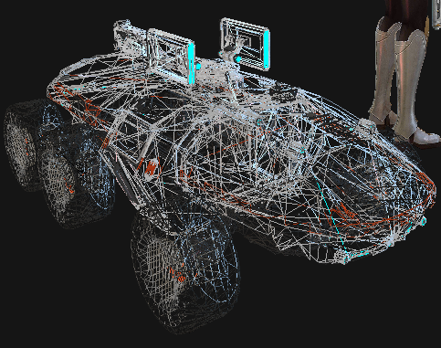
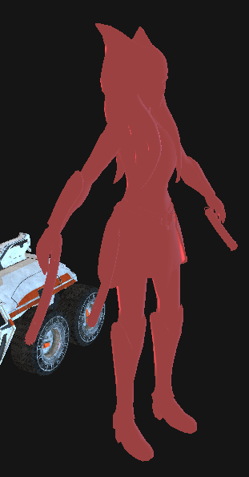

- Each scene is equipped with a camera capable of switching between an orthographic and perspective view as well as moving throughout the scene**\*\*\***

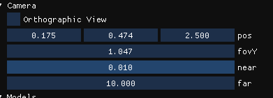

> Orthographic View
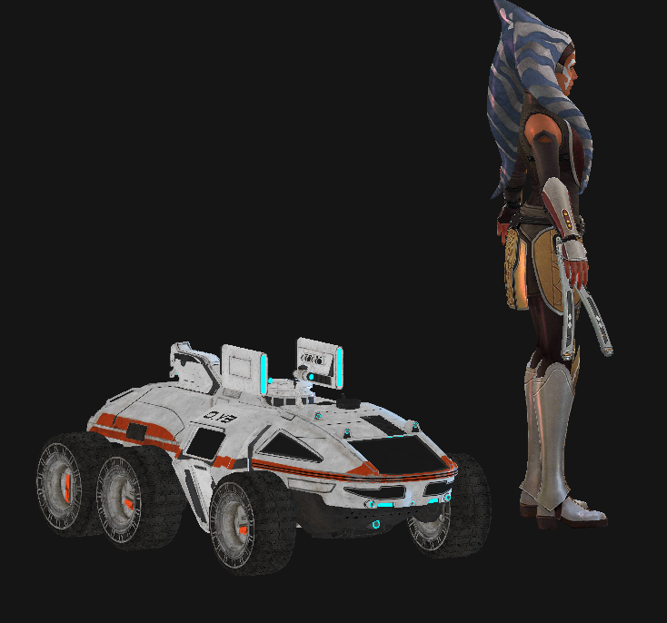

> Perspective View
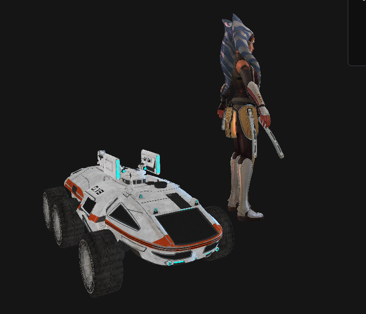

- Scene parameters such as the model(s), the transform, the camera and lighting are configurable via SCN files
- Can switch between scenes on the fly via a slider

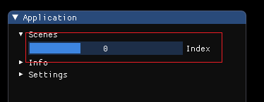

- Supports 3 types of light sources: Directional, Point & Spot
	* Adjustable ambient, diffuse & specular colors
	* Adjustable light constant, linear & quadratic to determine intensity
	* Also includes adjustable position, direction, and cut off depending on the light type
	* Only 1 light(directional) is enabled by default in each scene

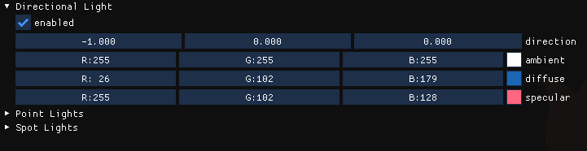

> A directional light
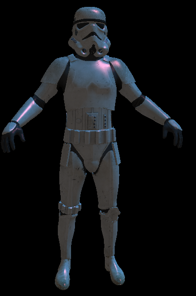

> A spot light
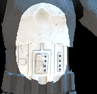

- Logs
	* ERROR, WARNING, FATAL, INFO & DEBUG logs available in terminal window
	* Logs produced during session are also appended to the files 'Logs/message.log' and 'Logs/error.log'
	* If the files do not exist, they are created

### Controls
- '9' : Enter Camera mode
- '0' : Exit Camera mode
#### Camera
- **w, a, s, d**                  : forward, left, back, right** \*\*\*\* **
- **spacebar**                 : up
- **CTRL**                           : down
- **mouse/touchpad**    : rotate
- Camera Position, as well as FOV, near & far can be adjusted manually via camera settings in the ImGui menu

### Bugs & Incomplete Features
- For now, only OBJ files with only triangle faces are handled properly. If faces have 4 vertices or a mix of the two, the object is not rendered correctly.

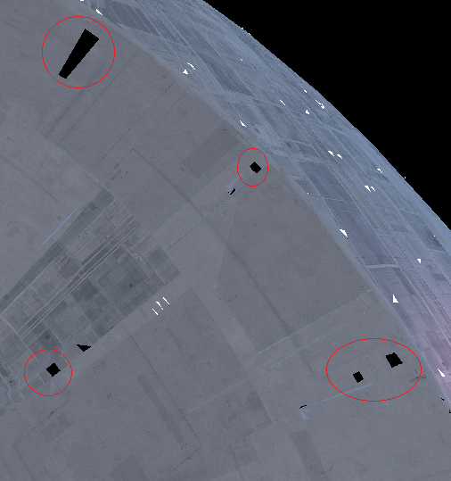
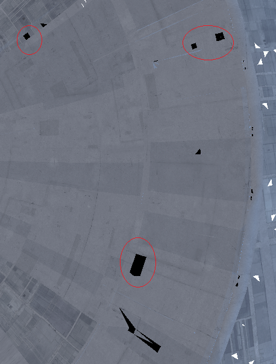

- Occasionally there are triangles that do not take into account that the texture and render as white. Note that this only occurs with Death Star model in the SPACE.SCN

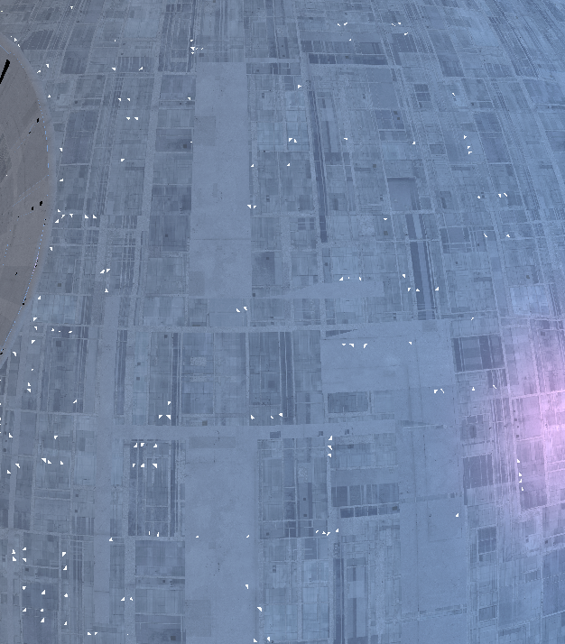

- Shadow Mapping not yet implemented

> The red boxes show where there should be shadows.
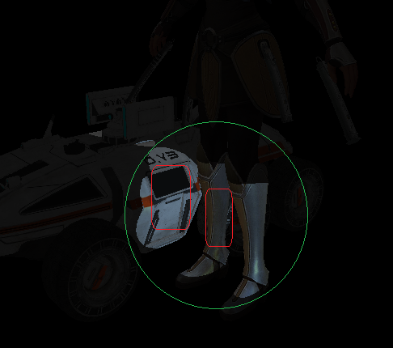

- Material light constants(Ns, Ka, Kd, Ks, Ke) in MTL files are not taken into consideration during the render process

- Spot lights edges appear unrealistic because only a single variable (cut off) was implemented instead of both an inner and outer cut off for a smoother transition between the spot light and the darkness

> Note that the edge of the spot light is abrupt and unnatural.
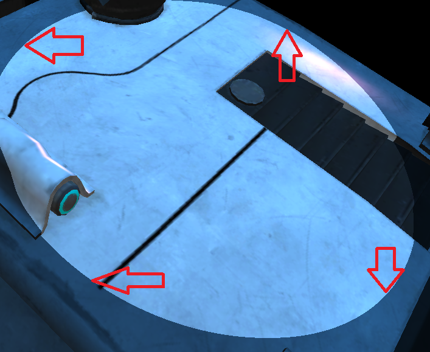

### Footnotes
**\*** Scale can only be manipulated uniformly, meaning models are scaled in the x, y, & z by the same amount.
**\*\*** If you are launcing the program after compiling the code or if the imgui.ini has been deleted the Application ImGui menu - *which contains the scene slider* - will be **BEHIND** the scene menu.

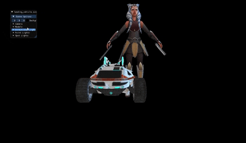

**\*\*\*** The FOV will automatically adjust to the best setting when switching between camera views.
**\*\*\*\*** Camera controls do not always function as expected in orthographic mode

### End
